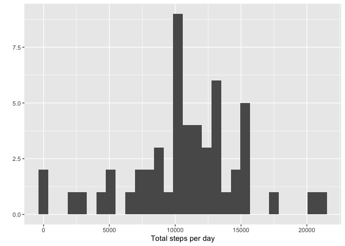
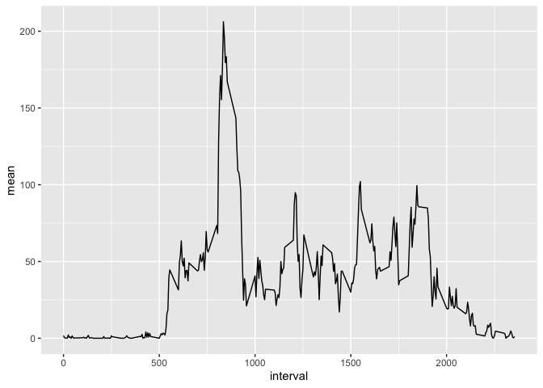
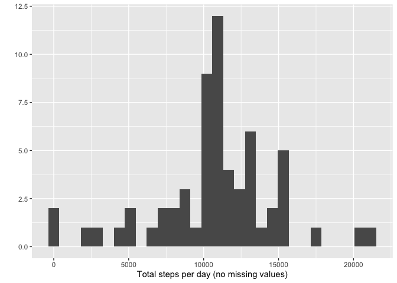
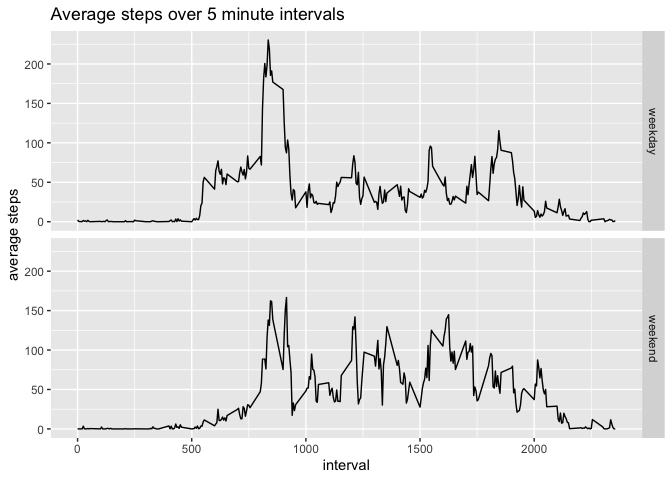

The data used here is from a personal activity monitoring device. It collected the number of steps taken at 5 minute intervals throughout the day for 2 months during the months of October and November 2012.

## Loading and preprocessing the data
In order to use certain functions in this report, 2 libraries must be loaded. The data is read with the headers included. The date is also processed to be a Date class instead of character.

```r
# load libraries
library(dplyr)
library(ggplot2)
# read in activity data: steps, date, interval
data <- read.csv("activity.csv", header = TRUE)
data$date <- as.Date(data$date)
```

## What is mean total number of steps taken per day?
First the total number of steps per day is calculated and put into its own table. This table is used to build a histogram.

```r
histdata <- aggregate(steps ~ date, data, sum, na.rm = TRUE)
qplot(histdata$steps, xlab= "Total steps per day")
```

<!-- -->

```r
stepsmean <- mean(histdata$steps)
stepsmedian <- median(histdata$steps)
```
The average amount of steps taken per day is 10766.19 and the median is 10765.

## What is the average daily activity pattern?
A time series plot of the 5-minute interval (x-axis) and the average number of steps taken, averaged across all days (y-axis) is given using ggplot.

```r
intervalmean <- aggregate(x=list(mean=data$steps), 
                          by=list(interval=data$interval), 
                          FUN=mean, 
                          na.rm=TRUE)
ggplot(intervalmean, aes(interval, mean))+geom_line()
```

<!-- -->

```r
stepmax <- max(intervalmean$mean, na.rm=TRUE)
stepintervalmax <- intervalmean[intervalmean$mean == stepmax,]$interval
```
The 5-minute interval, on average across all the days in the dataset, that contains the maximum number of steps is 835 with a value of 206.1698113.

## Imputing missing values

```r
totalna <- sum(is.na(data$steps))
```
The total number of missing values in the dataset is 2304. In order to fill these missing values the mean for the 5-minute interval is used to replace the "NA" in a new dataset that does not affect the orginal dataset. A histogram is shown to display the new total number of steps taken each day.

```r
newdata <- data
for(i in 1:length(newdata$steps)) {
  if(is.na(newdata$steps[i])){
    newdata$steps[i] <- intervalmean$mean[intervalmean$interval == newdata$interval[i]]
  }
}
newhistdata <- aggregate(steps ~ date, newdata, sum)
qplot(newhistdata$steps, xlab= "Total steps per day (no missing values)")
```

<!-- -->

```r
newstepsmean <- mean(newhistdata$steps)
newstepsmedian <- median(newhistdata$steps)
```
The mean of the total number of steps taken per day is 10766.19 and the median is 10766.19. The mean is not affected and is the same as the original value. The median value is slightly more than the original but not affected drastically and the new mean and median are also the same value. The estimates of the total daily number of steps are slightly less with missing values and increase as new values are put in. This is expected.

## Are there differences in activity patterns between weekdays and weekends?
For this part, a new factor variable was created to contain the 2 levels: weekday and weekend. The date column was used to determine the value of this new column. These values were used to create a panel plot comparing the 5-minute interval (x-axis) and the average number of steps taken, averaged across all weekday days or weekend days (y-axis).

```r
newdata$daytype <- weekdays(newdata$date, abbreviate = TRUE)
weekdayswitch <- function(x){
  switch(x,'Mon'='weekday','Tue'='weekday','Wed'='weekday','Thu'='weekday','Fri'='weekday',
         'Sat'='weekend', 'Sun'='weekend')
}
newdata$daytype <- sapply(newdata$daytype, weekdayswitch)
newdata$daytype <- factor(newdata$daytype, levels=c("weekday","weekend"))
newintervalmean <- aggregate(x=list(mean=newdata$steps), 
                          by=list(interval=newdata$interval, daytype=newdata$daytype), 
                          FUN=mean, 
                          na.rm=TRUE)
ggplot(newintervalmean, aes(interval,mean))+geom_line()+facet_grid(newintervalmean$daytype~.)+
  labs(y="average steps", title="Average steps over 5 minute intervals")
```

<!-- -->

Weekday activity seems to be more in the morning possibly due to getting ready for the day and going to work before sitting inside and then steps are lower for the rest of the day. On the weekends the activity is more consistent over the day but not high.
